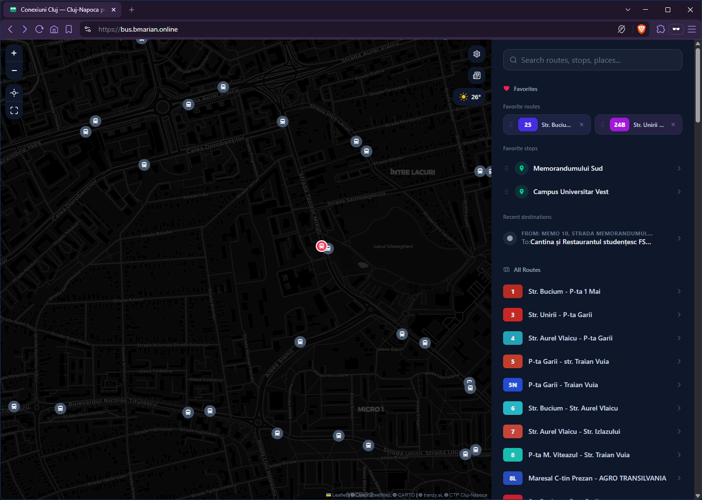
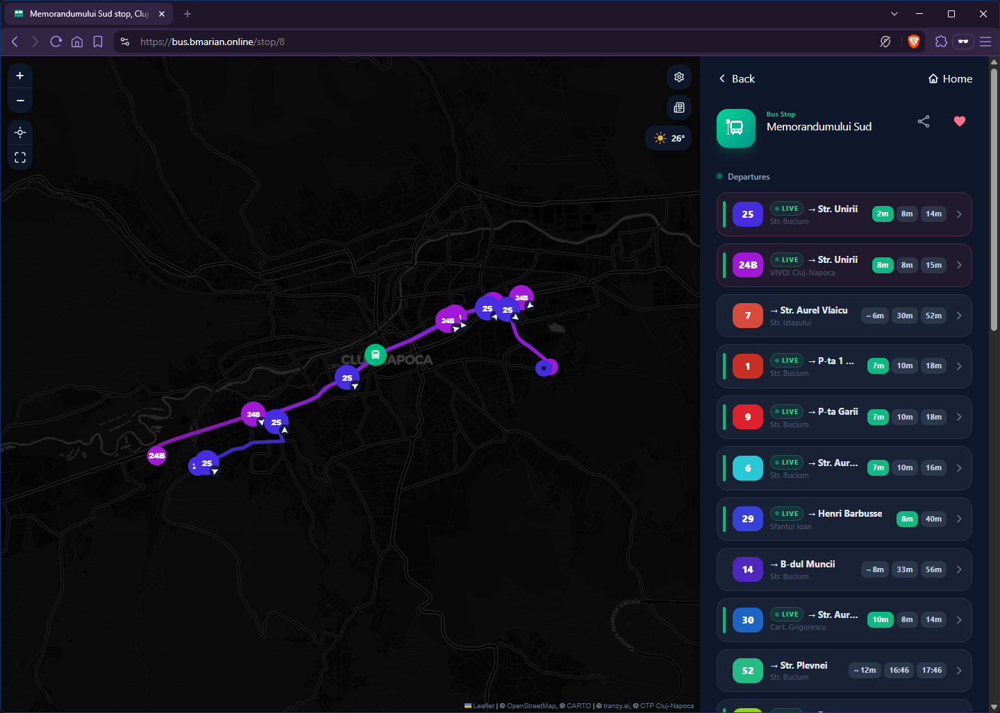
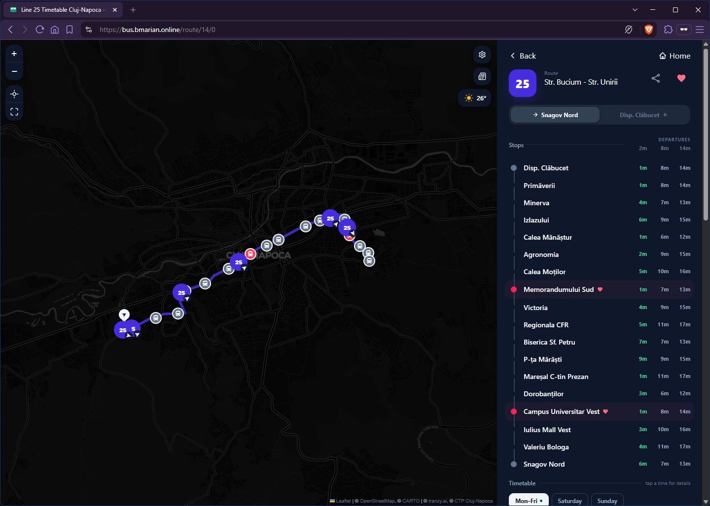
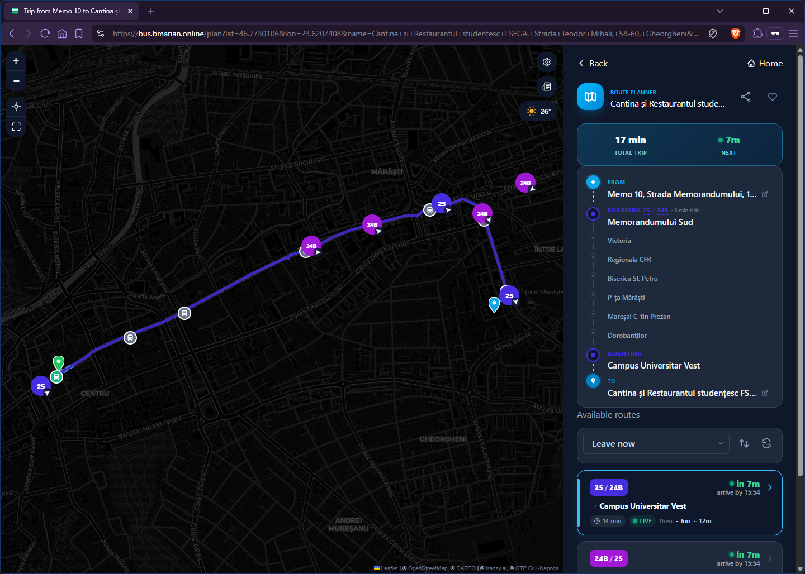

# Conexiuni Cluj

A live bus and tram tracker for Cluj-Napoca. I ride CTP every day and got tired of the official site, so I built the one I actually wanted to use.

**[bus.bmarian.online](https://bus.bmarian.online)**



## What it does

- Live map, every CTP bus and tram, positions updated every few seconds
- Live departures per stop, with a countdown that falls back to the schedule when a vehicle's GPS drops
- Full route timetables, pulled straight from CTP Cluj-Napoca
- A route planner: leave now, leave at, or arrive by
- Weather for Cluj
- Favorite routes and stops
- Follow a line and get notified when it's timetable changes
- Dark mode, installable as a PWA, works offline for cached data

There are a few hidden things scattered around for the curious. 🐣

|                                                                               |                                                                           |
| ----------------------------------------------------------------------------- | ------------------------------------------------------------------------- |
|                |  |
|  |                                                                           |

## Running it locally

You'll need Node ≥ 20.19, Go ≥ 1.25, and a [Tranzy](https://tranzy.ai/) API key.

```bash
cd backend
echo "TRANZY_API_KEY=your_key
CARTO_KEY=your_carto_key" > keys.env
go run .
```

```bash
cd frontend
npm install
npm run dev
```

The backend listens on `:6698`, the frontend dev server proxies to it. `npm run build` in `frontend/` outputs to `backend/dist/`, which the Go server serves directly, that's the whole production setup.

The route planner needs more: Java 21+, an `otp.jar` in `backend/services/otp/`, and a `cluj.pbf` extract in `backend/services/otp/cluj/`. [`update.sh`](update.sh) downloads and builds all of that (OTP jar, Osmosis, a Cluj-cropped OSM extract) if you want the full setup.

## Credits

| Source                                                       | Used for                                                                                   |
| ------------------------------------------------------------ | ------------------------------------------------------------------------------------------ |
| [Tranzy.ai](https://tranzy.ai/)                              | Live GPS positions and GTFS data for CTP Cluj-Napoca                                       |
| [CTP Cluj-Napoca](https://www.ctpcj.ro/)                     | Official timetable CSVs                                                                    |
| [Open-Meteo](https://open-meteo.com/)                        | Weather data                                                                               |
| [OpenStreetMap](https://www.openstreetmap.org/) contributors | Map data, © OpenStreetMap contributors, [ODbL](https://opendatacommons.org/licenses/odbl/) |
| [CARTO](https://carto.com/)                                  | Map tiles                                                                                  |
| [Nominatim](https://nominatim.org/)                          | Address search                                                                             |
| [OpenTripPlanner](https://www.opentripplanner.org/)          | Route planning                                                                             |
