# Conexiuni Cluj

A live bus and tram tracker for Cluj-Napoca. I ride CTP every day and got tired of the official site, so I built the one I actually wanted to use.

**[bus.bmarian.online](https://bus.bmarian.online)**

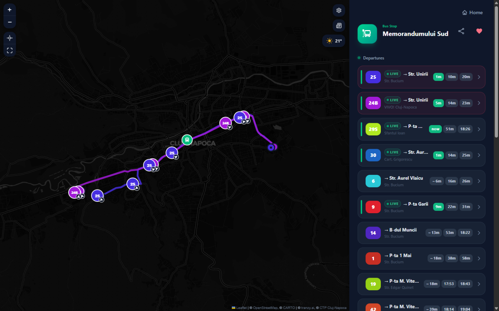

## What it does

- Every CTP bus and tram on the map, live
- Departures for any stop. Tracked buses get a live countdown, the rest show approximate times
- The times get better on their own: the server watches the buses and learns how long each stretch really takes, hour by hour
- Full timetables for every line, straight from CTP
- A route planner: leave now, leave at, arrive by, or the last one today
- Favorite stops, and favorite lines per direction
- Follow a line and get a notification when CTP changes its timetable or route
- Installable as an app, with partial offline support
- Move your favorites and settings to another phone or your watch by scanning a code
- Works from a hardware keyboard too, no arrow keys needed (hjkl and letter shortcuts)

There are a few hidden things scattered around for the curious. 🐣

<p align="center">
  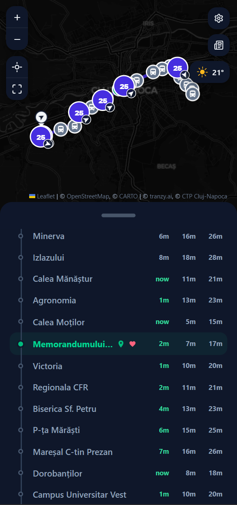
  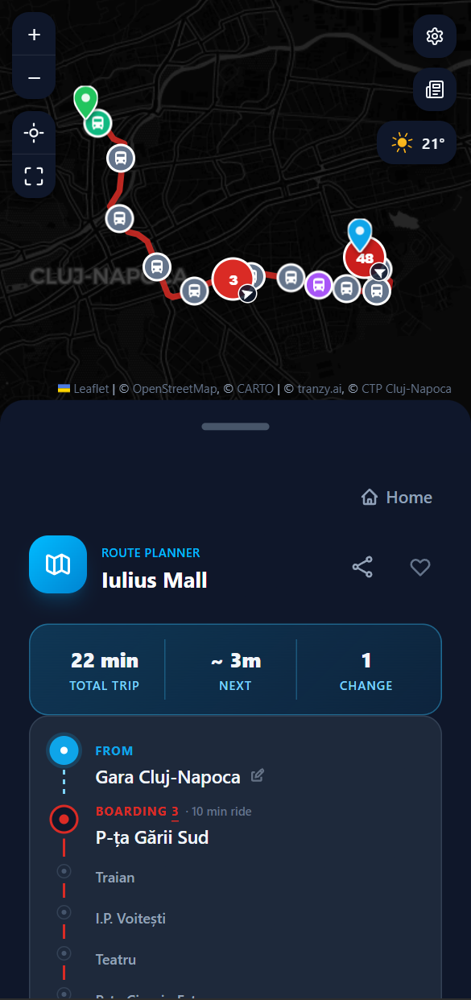
  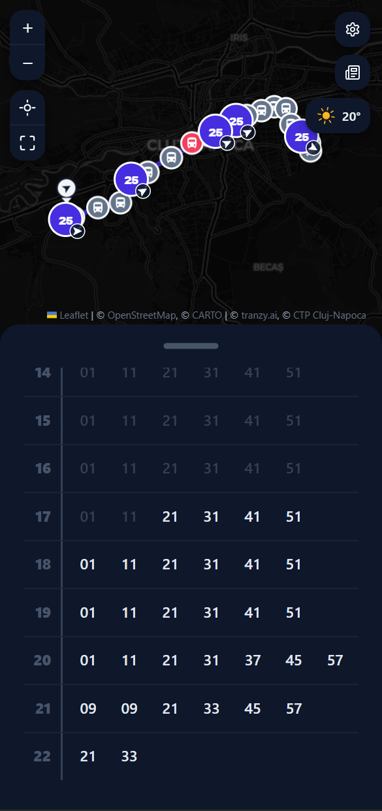
</p>

### Themes

<table>
  <tr>
    <td align="center">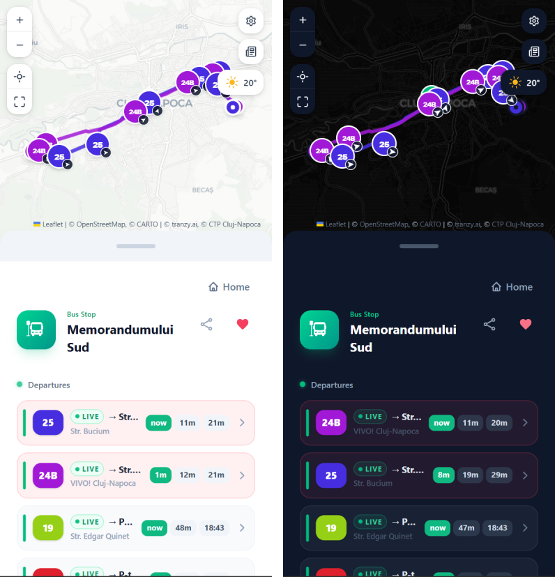<br><sub>Default</sub></td>
    <td align="center">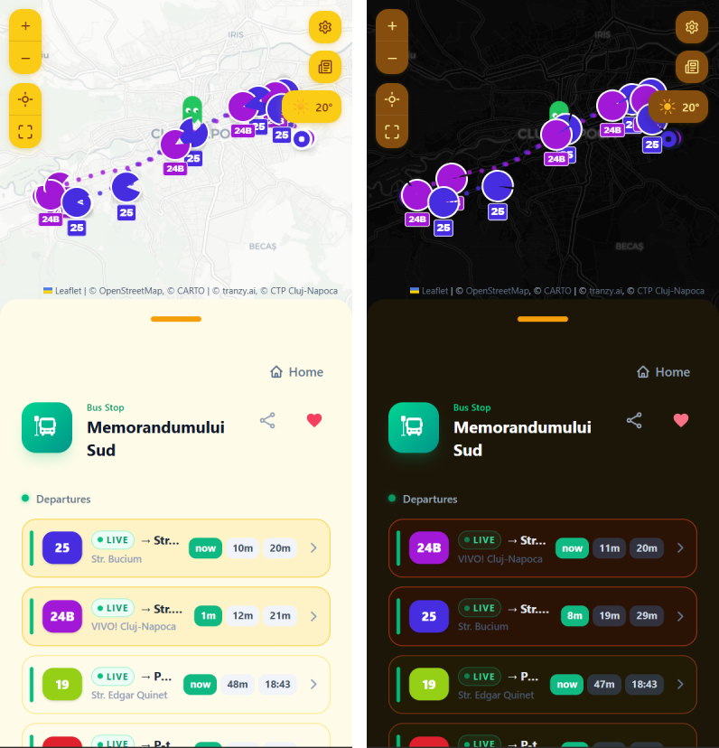<br><sub>Arcade</sub></td>
  </tr>
  <tr>
    <td align="center">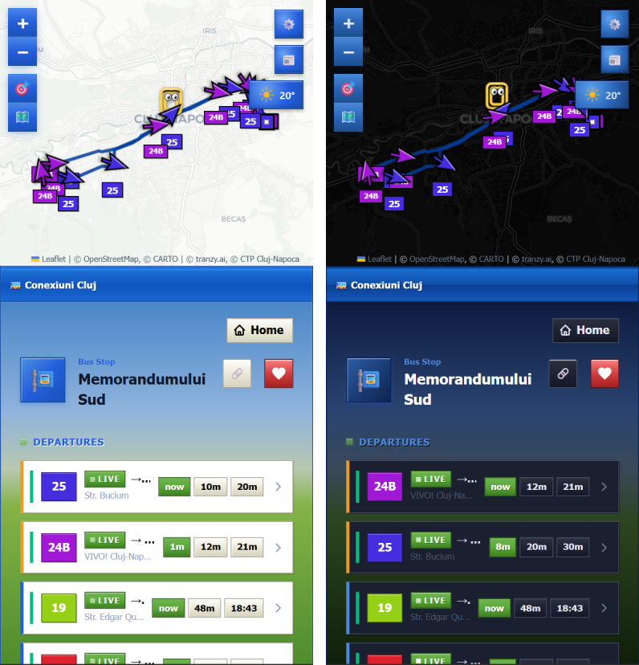<br><sub>Legacy Blue</sub></td>
    <td align="center">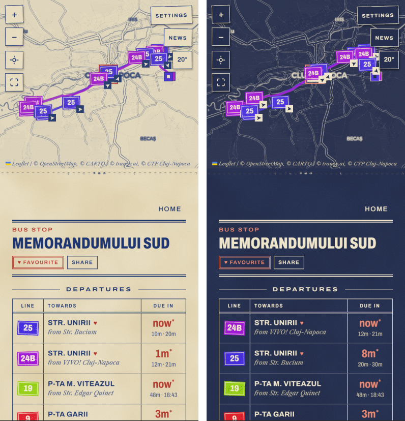<br><sub>Paper</sub></td>
  </tr>
</table>

### On a watch

It runs in a smartwatch browser too 🤷‍♂️

<p align="center">
  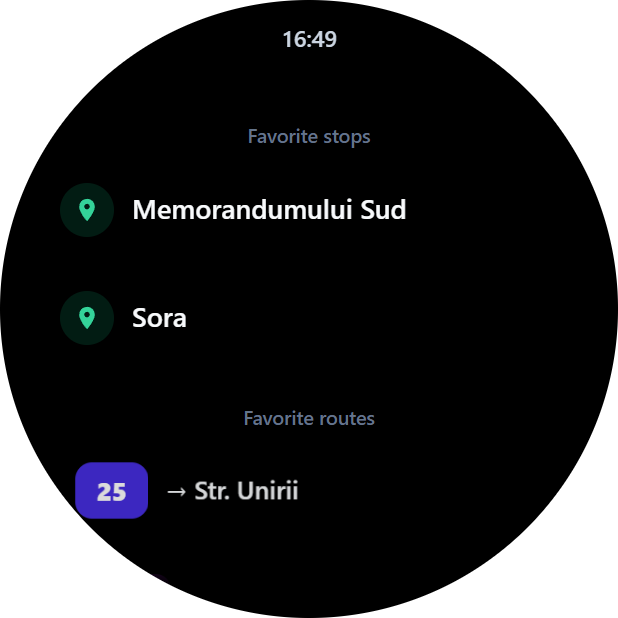
  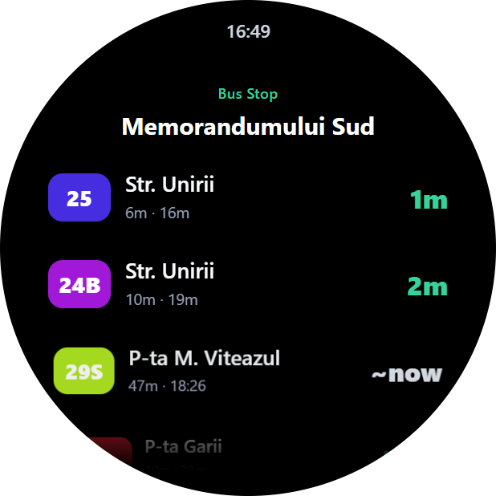
  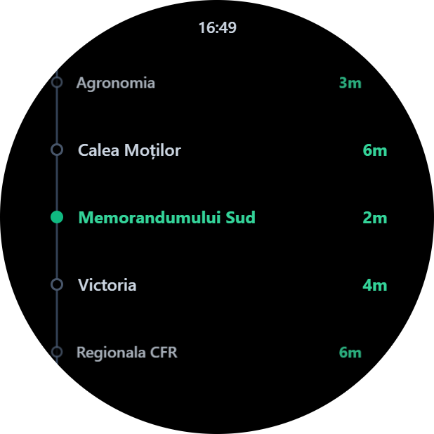
  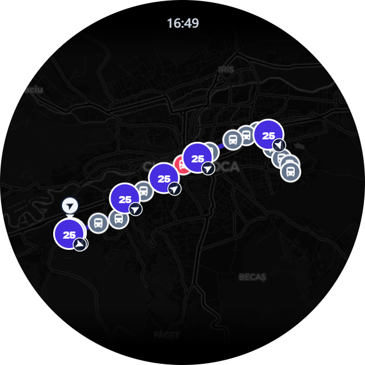
</p>

### On a Playdate

There's a [Playdate companion](https://github.com/bmarian/conexiuni-cluj-playdate) too. It syncs once over Wi-Fi, then stops, routes and timetables work offline.

<p align="center">
  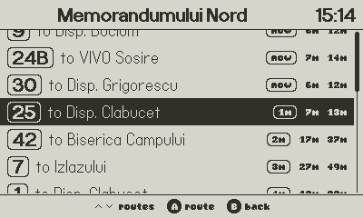
  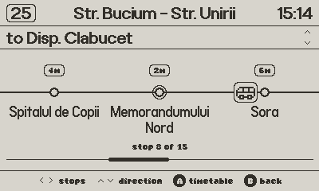
  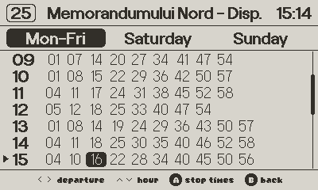
</p>

---

## Running it yourself

You'll need Node 20.19+ (or 22.12+), Go 1.25+, and a [Tranzy](https://tranzy.ai/) API key.

Put your keys in a `keys.env` next to this README.

```bash
TRANZY_API_KEY=your_tranzy_key
CARTO_KEY=your_carto_key
```

Then the backend and the frontend, each in its own terminal:

```bash
cd backend
go run .
```

```bash
cd frontend
npm install
npm run dev
```

The backend listens on `:6698` and the dev server proxies `/api` to it. Everything else has a default in [`.env`](.env).

**Push notifications** need a VAPID key pair in `keys.env` (`VAPID_PUBLIC_KEY`, `VAPID_PRIVATE_KEY`, and `VAPID_SUBJECT` as a contact email or URL). Without it the server runs with push turned off.

**The route planner** needs Java 21+, an `otp.jar` in `backend/services/otp/` and a `cluj.pbf` extract in `backend/services/otp/cluj/`. [`update.sh`](update.sh) downloads and builds all of that: the OTP jar, Osmosis, and a Cluj-cropped OSM extract.

**Production** is `npm run build` in `frontend/`, which writes to `backend/dist/`, and the Go server serves it directly. `update.sh` is what I deploy with.

## Credits

| Source                                                       | Used for                                                                                   |
| ------------------------------------------------------------ | ------------------------------------------------------------------------------------------ |
| [Tranzy.ai](https://tranzy.ai/)                              | Live GPS positions and GTFS data for CTP Cluj-Napoca                                       |
| [CTP Cluj-Napoca](https://www.ctpcj.ro/)                     | Official timetables                                                                        |
| [Open-Meteo](https://open-meteo.com/)                        | Weather data                                                                               |
| [OpenStreetMap](https://www.openstreetmap.org/) contributors | Map data, © OpenStreetMap contributors, [ODbL](https://opendatacommons.org/licenses/odbl/) |
| [CARTO](https://carto.com/)                                  | Map tiles                                                                                  |
| [Nominatim](https://nominatim.org/)                          | Address search                                                                             |
| [OpenTripPlanner](https://www.opentripplanner.org/)          | Route planning                                                                             |
